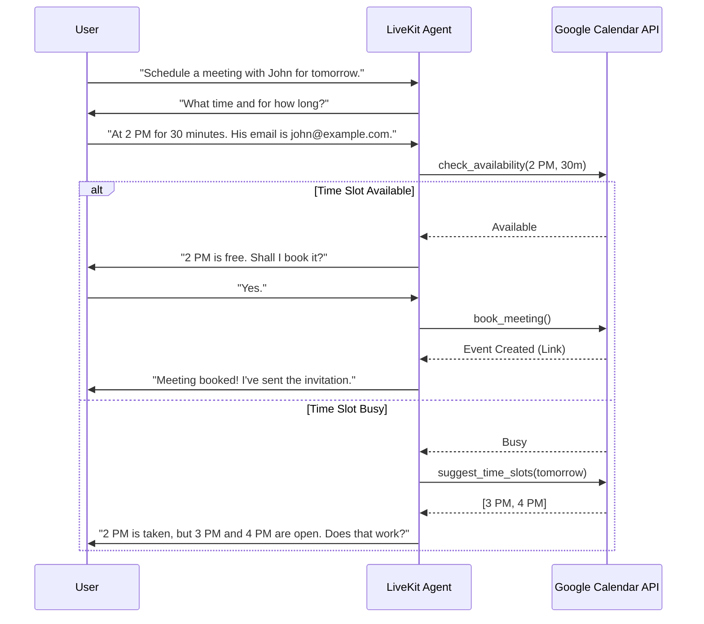

# 🎙️ LiveKit Voice Calendar Booking Assistant

[](https://www.python.org/downloads/)
[](https://livekit.io/)
[](https://opensource.org/licenses/MIT)

A real-time, multi-turn conversational voice agent built with LiveKit that helps users schedule Google Calendar appointments completely hands-free. The assistant intelligently gathers necessary information, checks your calendar for conflicts, suggests alternative time slots, and books the final meeting.

---

## ✨ Features

- **Real-Time Spoken Interaction**: Lightning-fast pipeline combining `STT -> LLM -> TTS`.
- **Intelligent Multi-Turn Flow**: Automatically recognizes missing details (like email or duration) and asks the user follow-up questions before booking.
- **Robust Tool-Calling**: Native integration with Google Calendar API using function calling:
  - 🔍 `check_availability`
  - 💡 `suggest_time_slots`
  - 📅 `book_meeting`
- **Zero-Credit Local Mode**: Run the entire pipeline locally for free using Whisper.cpp (STT), LM Studio (LLM), and Piper (TTS).
- **Provider Agnostic**: Easily swap between local models and cloud providers (OpenAI, Deepgram, etc.) through environment variables.

---

## 🏗️ Architecture & Voice Booking Flow

When a user interacts with the voice agent, the system follows a logical path to ensure accurate booking:



---

## 📂 Project Structure

```text
.
├── app/
│   ├── agent.py              # Main LiveKit agent, tool definitions, & provider switching
│   ├── calendar_service.py   # Wrapper for interacting with Google Calendar API
│   ├── config.py             # Environment configuration and loading
│   └── __init__.py
├── streamlit_app/
│   └── app.py                # Optional dashboard for setup and launching
├── .env.example              # Example environment configuration
├── pyproject.toml            # Dependencies and uv package setup
└── README.md
```

---

## 🚀 Setup Instructions

### 1. Install Dependencies
This project uses `uv` for incredibly fast Python package management.
```bash
# Install dependencies into a virtual environment
uv sync
```

### 2. Environment Configuration
```bash
cp .env.example .env
```
Edit `.env` to match your specific setup.

### 3. Google Calendar Credentials
To allow the agent to read and write to your calendar:
1. Obtain a `service_account.json` file from the Google Cloud Console.
2. Place it in the root directory.
3. Ensure `GOOGLE_SERVICE_ACCOUNT_FILE=service_account.json` is set in your `.env`.
4. **Important**: Share your specific Google Calendar with the email address found inside the service account JSON.

### 4. Running the Agent
Download the necessary LiveKit local model assets and start the console agent:
```bash
uv run python app/agent.py download-files
uv run python app/agent.py console
```

### 5. Optional Dashboard
Launch the Streamlit helper UI:
```bash
uv run streamlit run streamlit_app/app.py
```

---

## 💻 Zero-Credit Local Mode

Want to run everything locally without paying for API credits? This project fully supports local inference!

Make sure your `.env` contains:
```env
LLM_PROVIDER=local
STT_PROVIDER=local
TTS_PROVIDER=local
```

You will need to have your local services running:
1. **Local LLM**: Start an LM Studio server at `http://127.0.0.1:1234/v1`
2. **Local STT**: Start an OpenAI-compatible transcription server (e.g. Whisper.cpp) at `http://127.0.0.1:8001/v1`
3. **Local TTS**: Start an OpenAI-compatible speech server (e.g. Piper) at `http://127.0.0.1:8002/v1`

---

## ☁️ Cloud Providers (Optional)

If you prefer using high-performance cloud providers, you can easily swap them back in your `.env` file:

```env
LLM_PROVIDER=openai
STT_PROVIDER=deepgram
TTS_PROVIDER=openai
```
*Note: Make sure to provide the corresponding `OPENAI_API_KEY` and `DEEPGRAM_API_KEY` in your `.env` file.*
